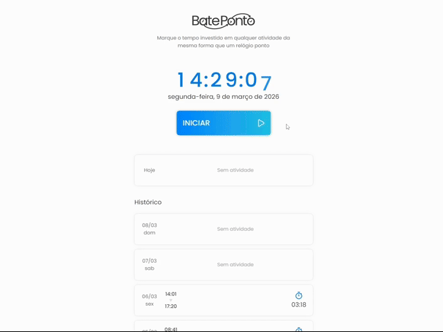

<div align="center">
  

  <h1>BatePonto</h1>
 
  <p>Aplicação para registro e acompanhamento de períodos de atividade.</p>

[](https://bateponto-ten.vercel.app/)  

  

</div>

<br />

Aplicação para registrar tempo e calcular períodos em atividade utilizando um relógio ponto, utiliza armazenamento local para persistência e permite visualizar e editar registros de um período de até 30 dias.

---

## Tecnologias Utilizadas

- HTML
- CSS
- CSS Modules
- TypeScript
- React
- Vite
- Vitest

---

## Arquitetura

A aplicação consiste em uma SPA dividida em duas camadas independentes: interface e handlers (classes responsáveis pelas regras de negócio e manipulação do localStorage).

### Fluxos

#### Nova batida

1. **Registro de batida**  
   O usuário registra uma batida.
3. **Atualização do registro**  
   A aplicação atualiza o registro do dia referente a batida e calcula o tempo em atividade.
4. **Salvamento da batida**  
   A aplicação salva o registro no localStorage.
5. **Atualização do estado**  
   A aplicação atualiza o estado da interface com o novo registro.

#### Editar relatório

1. **Abertura do registro**  
  O usuário abre o editor de registro.
2. **Cópia do registro**  
  A aplicação cria uma cópia editável do registro e disponibiliza através do editor.
3. **Alterações**  
  O usuário altera o que desejar na cópia e salva.
4. **Atualização do registro**  
  A aplicação substitui o registro antigo pela cópia editada no localStorage.
5. **Atualização da interface**  
  A aplicação atualiza o estado da interface com o novo registro.

### Gerenciamento de Estado

A aplicação gerencia estados globais utilizando dois React Context, um para os registros e outro para a edição, ambos englobam os estados e funções necessárias para efetuar as alterações na camada de interface e a comunicação com a camada de handlers.

O `ClockContext`, responsável por manipular os registros na interface, encapsula estados como `inActivity`, que registra se o usuário está em atividade, além de funções como `addCheckpoint`, que adiciona uma nova batida através da API do handler e atualiza o estado `reports`, que mantém os registros em memória.

Já o `EditContext`, encarregado de fornecer as ferramentas para editar registros, mantém o estado `inEditionReport`, que armazena uma cópia do registro a ser editado, além de funções como `addCheckpoint`, `eraseCheckpoint` e `validateNewCheckpoint`, úteis para editar a cópia do registro.

O React Context foi escolhido por ser nativo do React e suficiente para a escala do projeto, evitando dependências externas como Zustand ou Redux.

### Armazenamento

A aplicação salva os registros em formato JSON no localStorage, sendo um array de tamanho fixo contendo os registros dos últimos 30 dias. Sempre que a aplicação é aberta, é executada uma verificação para garantir que o período está atualizado. Caso seja identificado que não está, são descartados registros mais antigos que 30 dias e são adicionados novos.

O limite de 30 dias visa manter o processamento do JSON eficiente, porém, é possível alterar o limite através da constante `REPORTS_RANGE_DAYS`.

### Registros e Handlers

Cada registro corresponde a um dia, sendo um objeto com as propriedades `id` (Unix Timestamp do dia), `checkpoints` (array ordenado de Unix Timestamps de cada batida), `sum` (milissegundos em atividade) e `status` (controle do sistema de correção de virada de dia).

A aplicação possui dois handlers:

- **ClockHandler**
  Responsável por criar e manipular a lista de registros, mantendo-a sincronizada com o localStorage. Ao ser instanciada, verifica e corrige o período dos registros se necessário, e cria um mapa associando os ids aos registros
- **ReportHandler**
  Responsável por editar registros individualmente, armazena a referência do registro e o altera diretamente, servindo como um Mutator

### Correção se virar o dia em atividade

Sempre que a aplicação abre, é executada uma verificação se o dia anterior foi encerrado em atividade, caso tenha sido o caso, adiciona uma batida no último milissegundo do dia anterior e outra no primeiro milissegundo do dia corrente. Visando manter a soma dos períodos correta caso o usuário ultrapasse a meia-noite em atividade.

O controle do sistema de correção é feito utilizando a propriedade `status` do registro, caso tenha o valor de `notVerified`, a verificação é efetuada e o status muda para `verified`, caso uma correção ocorra, altera para `corrected`. O modal que notifica a correção para o usuário utiliza essa propriedade para decidir se deve aparecer, a propriedade também é responsável por garantir que, caso o usuário exclua manualmente uma batida, uma correção equivocada não ocorra.

Além da verificação ao abrir, a aplicação sempre agenda uma atualização dos registros para meia-noite utilizando um `setTimeout` visando atualizar o estado caso a aplicação esteja aberta durante a meia-noite.

Devido ao sistema de correção, não é possível adicionar batidas manualmente no primeiro e último milissegundo do dia, sendo timestamps reservados para correções.

### Testes unitários

A aplicação utiliza o Vitest para efetuar testes unitários no `ClockHandler`, visando cobrir que o handler mantenha a estrutura dos registros correta no localStorage. Dentre os comportamentos testados, estão o de criação de relatórios caso o localStorage esteja vazio, correção de período, adição de batidas automáticas, falhar ao adicionar batida no futuro ou mais antiga que 30 dias, etc.

---

## UI / UX

A interface da ferramenta foi previamente planejada no Figma e replicada em código, possuindo a característica de alterar sua cor principal entre azul e laranja a depender se o usuário está em atividade. A transição entre as cores é feita de forma suave utilizando a propriedade `transition`.

### Relógio com dígitos animados

O relógio principal da aplicação possui uma animação em cada dígito, onde os números descem semelhante a um Flip Clock, a animação utiliza dois `<span>` que alternam de valor, posição e opacidade, criando a ilusão de substituição. A animação não altera o DOM e utiliza apenas propriedades "compositor-only" como `opacity` e `transform`, visando desempenho.

Devido a otimizações do navegador, a animação pode sofrer distorções ao sair e retornar na página. Visando evitar isso, foi implementado o hook personalizado `usePageVisibility`, que utiliza event listeners de visibilidade para ativar e desativar a animação do relógio, visando manter a animação sincronizada.

### Modals

A aplicação possui o componente `<Modal>`, responsável por abstrair e tornar a criação de modals (ou "modais") reutilizável. O componente utiliza o elemento `<dialog>`, que nativamente já fornece recursos para modals e acessibilidade, em conjunto com a função nativa do ReactDOM `createPortal`, que renderiza o retorno do componente em outra parte do DOM, nesse caso logo abaixo do `<body>`.

### Histórico de registros

O histórico de registros possui comportamento de lazy loading, onde é utilizado um `IntersectionObserver` para detectar que o usuário deseja ver registros mais antigos. Esse comportamento tem como objetivo melhorar o desempenho, diminuindo a quantidade de registros renderizados inicialmente.

### Acessibilidade

A aplicação também é adaptada para ser acessível via leitores de tela, ocultando ícones decorativos através do atributo `aria-hidden` e definindo descrições para ícones informativos utilizando `title`. Além disso, devido ao relógio possuir dois `<span>` para cada dígito, a leitura em leitores de tela ficaria confusa, por isso, o relógio é substituído por um `<span>` oculto com o horário completo para garantir a leitura.

---

## Desafios Técnicos

### Sincronia entre interface, handler e localStorage

Devido à separação das camadas, a aplicação precisa sincronizar os registros entre o JSON que está no localStorage, o mapa dos registros no handler e o estado da interface.

Visando garantir a sincronia, o handler efetua inicialmente a leitura do localStorage, que nesse momento é a fonte da verdade, e cria o mapa com os registros, agora o handler passa a ser a fonte da verdade, é a partir dele que o estado da interface é retornado, além de que qualquer alteração efetuada através da API do handler propaga para o localStorage através do método `updateLocalStorage`, já a sincronização do estado na interface é responsabilidade do `ClockContext`, que efetua as chamadas para a API do handler a atualiza o estado utilizando valores atualizados retornados.

### Correção de período

A aplicação deve manter uma janela de 30 dias consecutivos de registros salvos no localStorage, sendo o dia corrente mais os 29 dias anteriores.

Para manter essa estrutura, a correção dessa janela utiliza um algoritmo que filtra os dias que ultrapassam a data limite e itera sobre esse filtro, sendo cada iteração responsável por excluir um registro e adicionar um novo no lugar. Efetuar a correção dessa forma permite que a aplicação consiga manter a estrutura correta independentemente do tempo em que não é acessada.

---

## Possíveis Melhorias Futuras

- ### LocalStorage versionado

  Um sistema de versões para o localStorage, onde no código da aplicação existe uma constante com um identificador único de versão que o desenvolvedor altera se a estrutura de armazenamento mudar, esse identificador é armazenado junto aos registros na primeira execução da aplicação, nas próximas execuções a aplicação verifica se a versão no código e a do localStorage são as mesmas, de forma a garantir que se a estrutura de dados que a aplicação espera mudar em alguma atualização, isso seja corrigido automaticamente, sem o usuário ser afetado.

- ### Relatórios

  Gerador de relatórios com períodos personalizáveis que calcule métricas como média de tempo em atividade, dia mais ativo, média de tempo por período, etc. Isso seria possível por meio de um novo handler, responsável por consultar os registros, efetuar os cálculos e retornar eles para uma interface exibir.

- ### Exportação e importação

  Um sistema que permite exportar e importar todos os registros via um arquivo JSON. Esse sistema seria acessível por meio da interface, permitindo ao usuário importar um arquivo JSON que seria validado e substituiria os registros do localStorage ou exportar os registros atuais para um arquivo que seria baixado.

---

## Como rodar o projeto localmente

```bash
git clone https://github.com/gabriel23052/bateponto.git
cd bateponto
npm install
npm run dev
```
